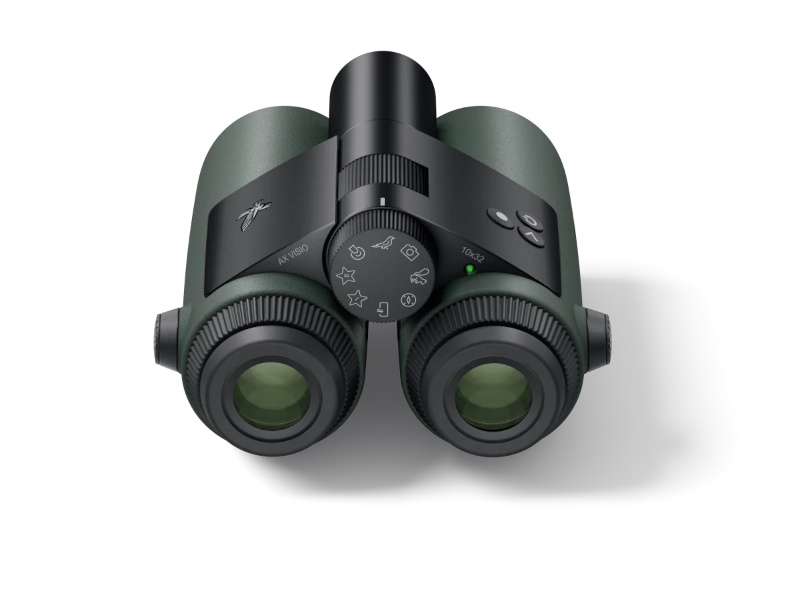
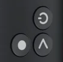

# AX Visio

The [AX Visio](https://www.swarovskioptik.com/us/en/hunting/products/binoculars/ax-visio)
is a new AI supported binocular by
[Swarovski Optik](https://www.swarovskioptik.com/us/en/hunting).
For the product details see the page
[Binoculars > AX Visio > AX Visio](https://www.swarovskioptik.com/us/en/hunting/products/binoculars/ax-visio/ax-visio-binoculars/ax-visio).

## Technical Details

This introduction only describes the AX Visio relevant details for using
OpenAPI. For additional guidance see the User Manual of the AX Visio on the
page
[AX Visio > Downlaods](https://www.swarovskioptik.com/us/en/hunting/products/binoculars/ax-visio/ax-visio-binoculars/ax-visio#downloads).

## Mode Selection Wheel

The mode selection wheel, or just selection wheel, is in the center of the
binocular. It controls which application is currently active. There are eight
different symbols on the selection wheel. For example a symbol for the camera
application or a symbol for the Merlin Bird Id application.

The OpenAPI functionality and app has the following symbol:

To activate an application you have to rotate the selection wheel until the
symbol is at the top of the binocular.

## Buttons

The AX Visio has three buttons.

There named as following:

* release button (big dot icon): bottom left on the image
* arrow button (arrow icon): bottom right on the image
* power button (power icon): upper right on the image

Additionally the release button has two different press states, half pressed
and fully pressed. The power button is also special. It can only be used to
power on or off the device or turn on and off the display. It does not control
the functionalities inside the apps.

To control the apps you only use the release and the arrow button.

## Inside vs Outside Applications

In the context of the AX Visio you have to distinguish between two different
kind of applications or apps.

There are applications that run on the binocular itself. E.g.  the Camera
Application or the Merlin Bird Id application. These can be started or
activated by rotating the mode selection wheel. These apps are called *Inside*
applications.

And there are applications that run on your personal smartphone and connect to
the AX Visio. E.g. the [Swarovski Optik Outdoor
App](https://play.google.com/store/apps/details?id=com.swarovskioptik.outdoor)
or an third party Application that uses the OpenAPI to connect to the
binocular. These apps are called *Outside* applications.

## Display Screen

The AX Visio contains a semi transparent display in the right eyepiece. So you
see the real world and additional the UI elements of currently active
application.

The display is a monochrome display and the display color is red. So it can
only draw red pixels with different opacities.

## Camera

The camera of the AX Visio is located between the two eyepieces. When it takes
an image, it does not capture exactly the same view as the human observer. The
camera has it's on optical path. Nevertheless the optical camera setup tries
mimic the optical properties of the human eyepieces.
