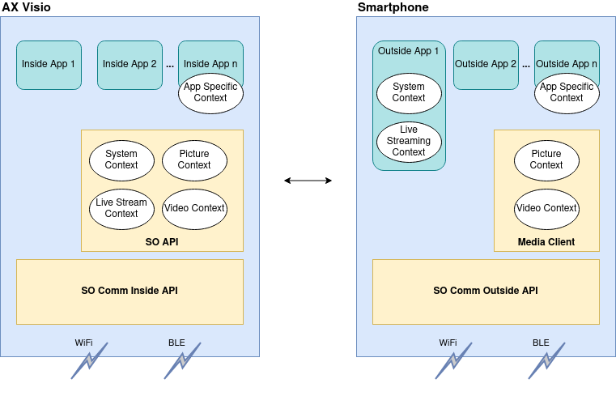

# SO Comm SDK

The SO Comm SDK is a set of APIs, which are grouped into SO Comm Inside API for
device development and SO Comm Outside API mainly for smartphone/tablet
development. These SDKs allow to reuse WiFi and BLE communication routines for
multiple products. By separating the behavior and communication routines from
data definitions, into different artifacts we also aim to have stable behavior,
but of course flexible data definitions for the different product needs.

For the OpenAPI only the SO Comm Outside API is relevant.

## SOContext Concept

Swarovski Optik devices are able to run in different device modes (Inside
Apps). For example, the AX Visio can run the Photo/Video or Bird ID App.
Depending on the Inside App (and also depending on the state of the Inside App)
different communication needs might be present.

On the other hand, Swarovski Optik devices support multiple Outside Apps
(running on a smartphone or tablet for example). These Outside Apps also have
different communication needs. For example, the Merlin App is only interested
in receiving photos and being able to configure settings for the Bird-ID Inside
App, but it is not interested in receiving a live stream from the SO device or
video recordings.

Each of the communication features mentioned above (e.g. receiving photos),
includes various communication endpoints. Moreover, different communication
technologies (in our case WiFi, Bluetooth Low Energy (BLE)), communication
protocols (BLE GATT, Wifi MQTT, RTP) and access control requirements are
present.

Therefore, the SO Comm SDK introduces a new layer for handling communication
endpoints: [SOContexts](../reference/SharedDefinitions/com.swarovskioptik.comm.definition/-s-o-context/index.html)

A SOContext contains a set of communication endpoints that are from a usage
point of view related to each other, have similar needs for communication
bandwidth and access control requirements. On Swarovski Optik devices
SOContexts can be provided by applications or system services, which might be
used by several applications. On smartphones apps can use a SOContext, when it
is provided by a Swarovski Optik device and the app has access to it.

Access is controlled using an API Key. See below for futher details.

## Inside and Outside API

To support the developers of Inside and Outside Apps two APIs have been
developed: The *SO Comm Inside API* the *SO Comm Outside API*. For the
Swarovski Optics OpenAPI only the later is relevant.

An Outside App registers to use one or multiple SOContexts via the
[SoCommOutsideAPI object](../reference/SDK/com.swarovskioptik.comm/-s-o-comm-outside-a-p-i/index.html)
Moreover, the SOContext defines whether BLE only is sufficient or also WiFi
will be used for transmitting data.

BLE is used as initial communication technology for connection establishment
and checking SOContext availability and is always available on the Device. If
one SOContext, which requires WiFi as communication technology (for bandwidth
reasons), is in use (i.e., an Inside App configured it as supported and an
Outside App registered to it), all communication with this Outside App will be
carried out using WiFi. Nevertheless, the BLE connection will be kept alive on
the Device to enable smooth transitions if WiFi is switched off for any reason.
Additional clients may connect via WiFi if the corresponding SOContexts are in
use by the first client and the client shared the WiFi credentials out-of-band
(e.g. via a QR code).

## Communication Endpoints

The following communication endpoints are supported by the SO Communication Inside API and Outside API at the moment:

* Topics (very similar to MQTT topics)
  A topic has a unique path which contains its name. A topic is either an "in" topic or an "out" topic. An "in" topic is a topic which will be subscribed by Inside Apps and can be used by Outside Apps to transmit information (publish) to Inside Apps. An "out" topic is a topic which will be subscribed by Outside Apps and can be used by Inside Apps to transmit information (publish) to Outside Apps.
* Topics are used only for small messages (i.e. < 100 kByte)
* FileTopics A normal Topic is used to transfer information, where a file can be downloaded using SCP. Also this data exchange can happen in both directions. From Inside to Outside App (e.g. pictures, videos) and from Outside to Insdie App (e.g. OTA update package).
* RTSP An Outside App can receive an RTSP server URL and connect to it for rendering the live video stream for example.

## SO Comm Outside API Library

The SO Communication Outside API encapsulates the complexity of handling
connections across multiple communication technologies - Bluetooth Low Energy
and WiFi. Outside App development can rely on the SO Communication Outside API
without considering protocol details, i.e., an abstract interface is provided.

An Outside App uses the SO Communication Outside API to configure its needed
SOContexts (use) and it is informed by the API if the current available
SOContexts have changed.

### Operations

To connect and disconnect to a AX Visio device, the methods are exposed:

* [fun connect(deviceName: String): Completable](../reference/SDK/com.swarovskioptik.comm/-s-o-comm-outside-a-p-i/connect.html)
* [fun disconnect(): Completable](../reference/SDK/com.swarovskioptik.comm/-s-o-comm-outside-a-p-i/disconnect.html)
* [val connectionState: Observable&lt;SOCommOutsideAPI.ConnectionState>](../reference/SDK/com.swarovskioptik.comm/-s-o-comm-outside-a-p-i/connection-state.html)

To use, unuse and see the available SOContexts, the following methods and variables exists

* [val availableContexts: Observable&lt;Set&lt;SOContext>>](../reference/SDK/com.swarovskioptik.comm/-s-o-comm-outside-a-p-i/available-contexts.html)
* [val contextsInUse: Observable&lt;Set&lt;SOContext>>](../reference/SDK/com.swarovskioptik.comm/-s-o-comm-outside-a-p-i/contexts-in-use.html)
* [fun use(context: SOContext): Completable](../reference/SDK/com.swarovskioptik.comm/-s-o-comm-outside-a-p-i/use.html)
* [fun release(context: SOContext): Completable](../reference/SDK/com.swarovskioptik.comm/-s-o-comm-outside-a-p-i/release.html)

After using a context, you can publish and subscribe to the topics in the SOContext:

* [fun &lt;T> subscribeTopic(topic: TopicOut&lt;T>): Observable&lt;T>](../reference/SDK/com.swarovskioptik.comm/-s-o-comm-outside-a-p-i/subscribe-topic.html)
* [fun &lt;T> publishTopic(topic: TopicIn&lt;T>, value: T): Completable](../reference/SDK/com.swarovskioptik.comm/-s-o-comm-outside-a-p-i/publish-topic.html)

To retrieve and send files the SO Comm Outside API provides the follwing
methods and objects, but before using these directly consider using the
[MediaClient](../reference/MediaClient/index.html) library.

* [SOCommFileApi](../reference/SDK/com.swarovskioptik.comm/-s-o-comm-file-api/index.html)
* [fun sendFile(topic: FileTopic, file: File): Flowable&lt;Int>](../reference/SDK/com.swarovskioptik.comm/-s-o-comm-file-api/send-file.html)
* [fun sendFile(topic: FileTopic, uri: Uri): Flowable&lt;Int>](../reference/SDK/com.swarovskioptik.comm/-s-o-comm-file-api/send-file.html)
* [fun subscribeToFiles(topic: FileTopic): Flowable&lt;SOCommFileApi.ReceivedFile>](../reference/SDK/com.swarovskioptik.comm/-s-o-comm-file-api/subscribe-to-files.html)

## Security Concept - API keys

The authentication of SOContext usage is based on API Keys.
These are unencrypted [JSON Web Token (JWT)](https://jwt.io/introduction/),
given out by Swarovski Optik to application developers.

An API key is tied to a specific set of SOContexts. For the OpenAPI usages the API key will
grant accees to the OpenAPI and the other relevant contexts.
See [OpenAPI > Available Contexts](../intro/openapi/#available-contexts).
