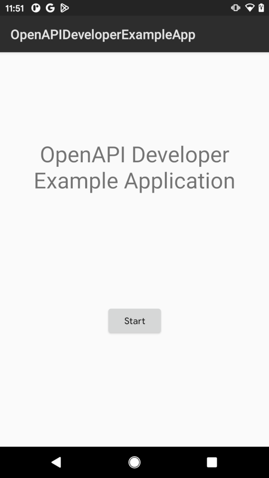
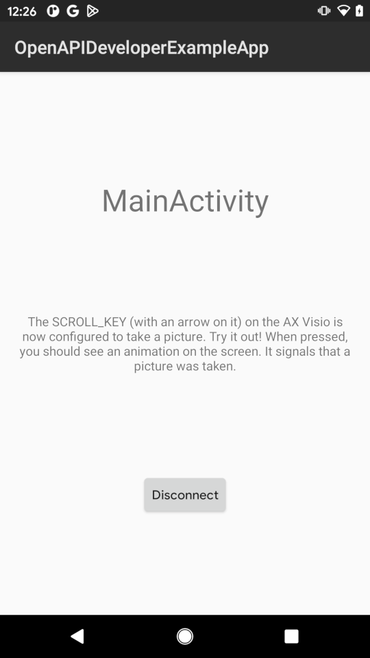

# Using the example application

This tutorial should walk you trough the necessary steps to build and deploy
the
[OpenAPI Developer Example Application](https://github.com/swarovskioptik/openapi-developer-example-app).

## Prerequisite

You must have

* a personal computer which is capable of building Android
  applications (This is possible on Windows, Linux and MacOS),
* an Android smartphone to run the example application,
* an AX Visio binocular and
* an personalized API key for using the OpenAPI
  contexts (See the tutorial
  [Requesting an API key](../tut/requesting-an-api-key.md)).

## Step 0: Android Studio Setup

If you are interested in the OpenAPI of the AX Visio you are mostly already an
Android Application developer.  So you should have a working
[AndroidStudio](https://developer.android.com/studio) installation on your
computer.  If not, follow the guide
[Install Android Studio](https://developer.android.com/studio/install).

## Step 1: Clone the example code

On your computer clone the example code. E.g. by executing the command

    $ git clone https://github.com/swarovskioptik/openapi-developer-example-app.git

You can also use the [Github CLI](https://cli.github.com/) for that.

## Step 2: Open the project in Android Studio

It's possible to build and deploy the project on the command line, but this
tutorial we use Android Studio. It will provide some convenience features like
selecting the development target and staring the smartphone application
automatically.

First open Android Studio by using the launcher menu of your operating system.
Then click *File > Open…* in the top menu bar and select the directory of the
freshly checkout repo.

Android studio starts parsing and executing the gradle build system. This
process will fail with the error message

> Please add 'OPENAPI_API_KEY' property!

This is o.k. for now. It will be fixed in the next step.

## Step 3: Set the API key

You must add your API key to the gradle build systems. First go into the root
directory of the repository. Either with an file browser or in the left
*project* window of Android Studio.

Open the file `local.properties`. The file should already exist, because
Android Studio created it when you first opened the project.  If the file does
not exist yet, you can also create it.

After that add the following line to the end:

    OPENAPI_API_KEY = <Add your API key here>

And replace the brackets with your API key.

Now the parsing and executing of the gradle build system should finish
successfully.  Click *Try Again* in Android Studio to restart it.

## Step 4: Build the example application

This can be either done on the command line or with Android Studio. The easiest
way is to use Android Studio, because it also allows you to deploy and start
the example application on your smartphone, too.

In Android studio click *Build > Make Project* in the menu bar at the top.  The
application should built successfully.

## Step 5: Deploy it on your smartphone

After building the application with your API key, you should run it on your
smartphone.  For that your smartphone must be in developer mode and connected
to your computer. Either with a USB cable or with the wireless debugging
feature of Android over Wi-Fi.

For instructions please read the
[Run apps on a hardware device](https://developer.android.com/studio/run/device)
Guide for Android Studio.

If your phone is setup and connected, you can deploy and run the
application by clicking *Run > Run 'app'* from the menu bar at the top.

On your smartphone you should see the following screen now:

## Step 6: Connect to the AX Visio

Your freshly built example app is running on your smartphone now. The next
steps are to connect the app with your AX Visio device.

For that the example shows instructions on the screen that walks the user
trough the process. In detail these are the following steps:

### Grant permissions and enable Bluetooth

On the smartphone touch the *Start* Button to start the connection process.

Now you should see a screen that tells the user to enable Bluetooth and grant
the necessary runtime permissions. You should touch the button and grant the
necessary permissions to the application. Then you should enable Bluetooth in
the settings menu of your smartphone.

When both requirements are fulfilled, the next screen appears.

### Search and connect to the AX Visio

The next screen of the app tells the user to start the AX Visio. Long press the
power of the AX Visio until you see that the status LED blinking green.  The AX
Visio is booting now.

When the AX Visio runs and the smartphone has found the AX Visio device, the
button on the screen is clickable and also shows the name the found device.

Click the button to start the connection process. If you connect your smartphone
with the AX Visio for the first time, your smartphone shows a pairing request
in the notification area.  Touch *Pair & Connect* to continue.

To finish the pairing process, you must enter a PIN on the smartphones display.
The PIN is shown in the display of the AX Visio. After entering the PIN and
continued the dialog, you have finished the paring process.

### Start the OpenAPI Inside Application

The example application is connected to the AV Visio. Now you have to start the
OpenAPI Inside Application on the AX Visio. The example app also shows
instructions on the screen.

Rotate the [mode selection wheel](../exp/ax-visio.md#mode-selection-wheel) to the
symbol of the OpenAPI. It looks like

The OpenAPI is successfully started on the AX Visio, when you see the text
"Please Connect" in the UI of the binocular. Trough the binocular you should
see

Then the *Continue* button in the example application is clickable, because the
OpenAPI is available on the AX Visio. Touch the button to start the main screen
of the example application.

## Step 7: Using the application

Now the example app is connected to the AV Visio and uses the OpenAPI.  You
should see the screen:

This means that your application succesfully connceted to the AX Visio and
successfully used one feature of the OpenAPI: it configured a key to take a
photo.

## Outlook

Congratulations! Now you have built, deployed and ran your first Android
application that used the OpenAPI of the AX Visio.

As next steps you can look at the code of the example application or read one
of the How-To guides.
